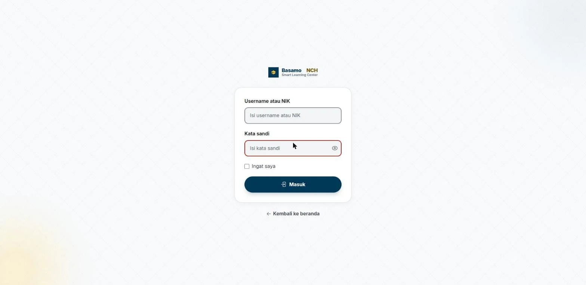
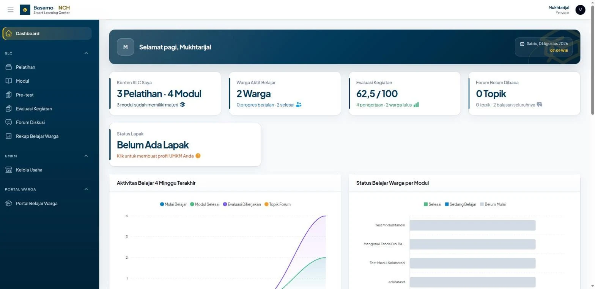
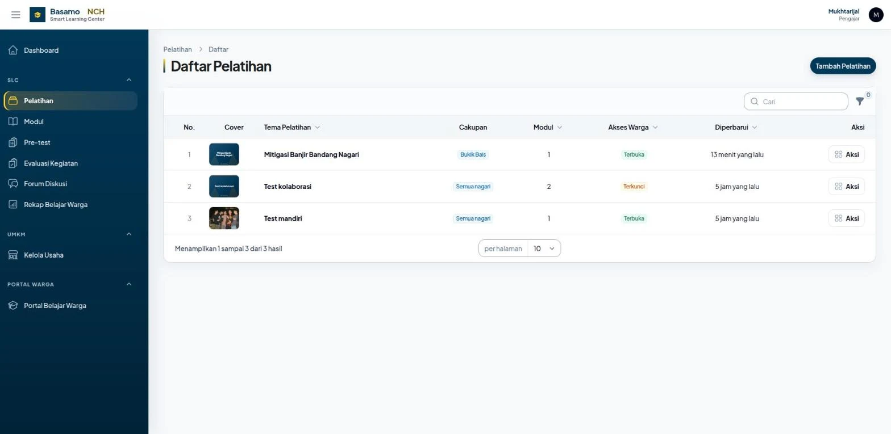
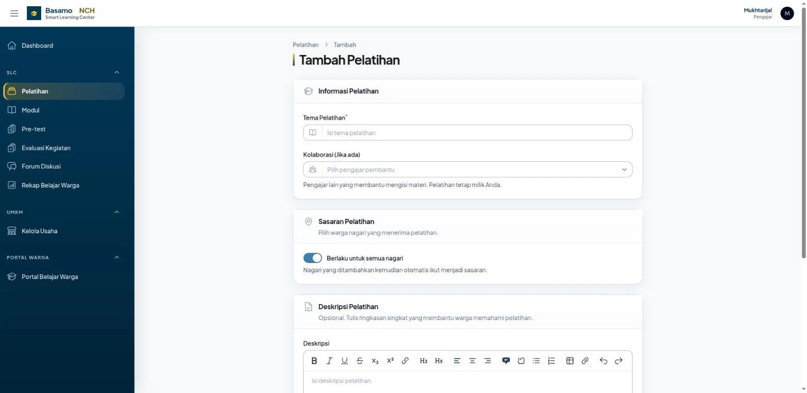
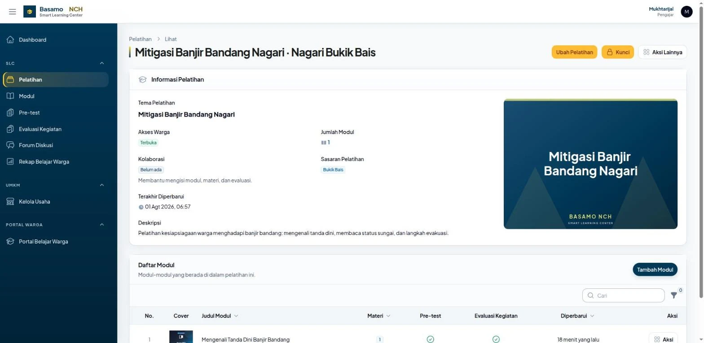
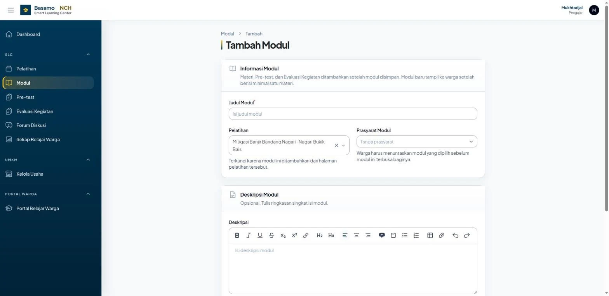
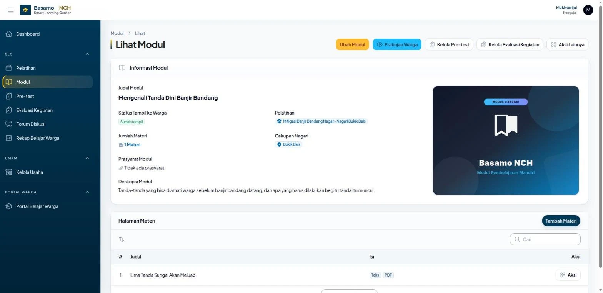
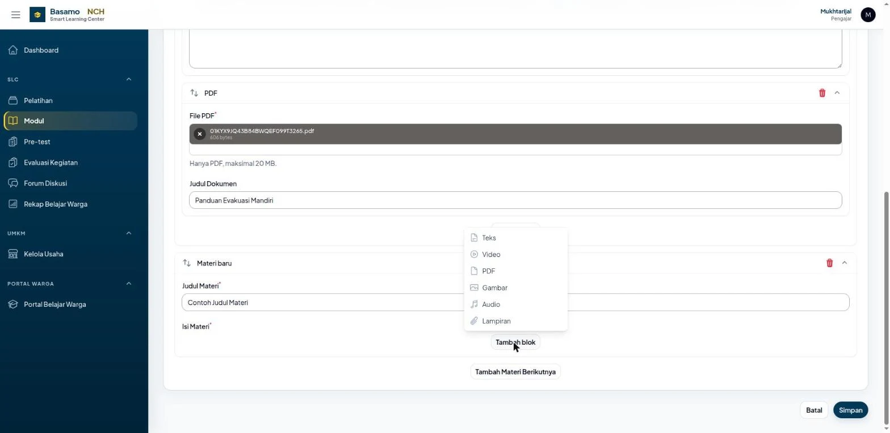
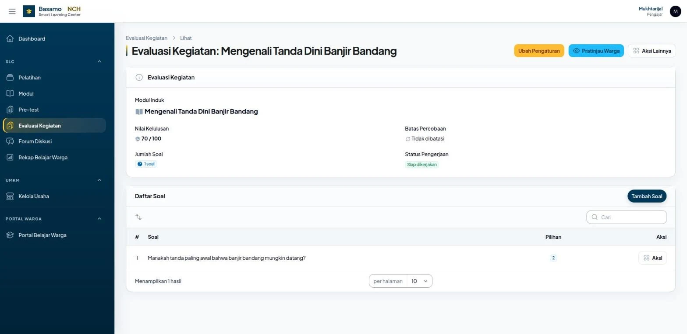
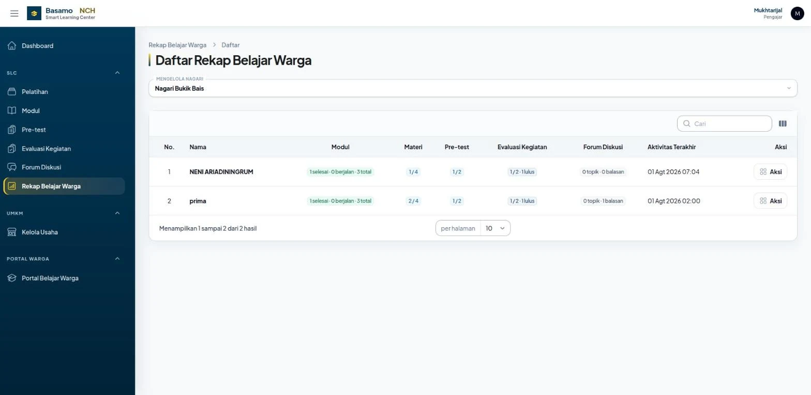

# Panduan Pengajar Smart Learning Center

Panduan lengkap mengisi pelatihan di Basamo NCH, dari masuk sampai memantau warga.
Seluruh tangkapan layar di bawah diambil dari sistem yang berjalan.

Panduan ini **khusus sisi pengajar**. Yang dilihat warga tidak dibahas di sini,
kecuali sejauh Anda perlu tahu kapan isi Anda sampai kepadanya.

---

## Daftar isi

1. [Masuk ke panel](#1-masuk-ke-panel)
2. [Mengenali dasbor](#2-mengenali-dasbor)
3. [Alur kerja: lima langkah](#3-alur-kerja-lima-langkah)
4. [Langkah 1 — Membuat pelatihan](#langkah-1--membuat-pelatihan)
5. [Langkah 2 — Menambah modul](#langkah-2--menambah-modul)
6. [Langkah 3 — Mengisi materi](#langkah-3--mengisi-materi)
7. [Langkah 4 — Pre-test dan Evaluasi Kegiatan](#langkah-4--pre-test-dan-evaluasi-kegiatan)
8. [Langkah 5 — Membuka untuk warga](#langkah-5--membuka-untuk-warga)
9. [Memantau belajar warga](#9-memantau-belajar-warga)
10. [Kolaborasi antar pengajar](#10-kolaborasi-antar-pengajar)
11. [Kapan isi Anda sampai ke warga](#11-kapan-isi-anda-sampai-ke-warga)
12. [Enam jenis blok materi](#12-enam-jenis-blok-materi)
13. [Slide presentasi (PowerPoint)](#13-slide-presentasi-powerpoint)
14. [Setelan video](#14-setelan-video)
15. [Aturan soal evaluasi](#15-aturan-soal-evaluasi)
16. [Menghapus dan mengubah](#16-menghapus-dan-mengubah)
17. [Bila ada yang tidak beres](#17-bila-ada-yang-tidak-beres)

---

## 1. Masuk ke panel

Buka alamat sistem, lalu **Masuk**.



- **Username atau NIK** — pengajar memakai **username**, bukan NIK. NIK dipakai warga.
- Pada login pertama Anda wajib mengisi **nama lengkap**, **lembaga atau instansi**,
  dan **kata sandi baru**. Anda juga boleh menyesuaikan username yang disarankan
  sistem. Nama dan lembaga akan ditampilkan pada profil serta aktivitas Anda di
  dalam sistem.
- Bila belum siap melanjutkan, tekan **Keluar**. Anda akan kembali ke halaman masuk
  tanpa melewati kewajiban mengganti kata sandi.

Akun dan kata sandi awal pengajar dikelola oleh **Superadmin**. Bila lupa kata sandi,
minta Superadmin menekan **Reset password**; sandi kembali ke sandi awal dan Anda
diminta melengkapi proses login pertama lagi.

Jika lupa username atau tidak mengetahui akun yang harus digunakan, hubungi **Admin**
untuk mendapatkan bantuan pemeriksaan akun.

---

## 2. Mengenali dasbor



Empat kartu di atas adalah ringkasan kerja Anda:

| Kartu | Artinya |
| --- | --- |
| **Konten SLC Saya** | jumlah pelatihan dan modul milik Anda, serta berapa modul yang sudah berisi materi |
| **Warga Aktif Belajar** | warga yang menyentuh modul Anda, dipisah antara yang berjalan dan yang selesai |
| **Evaluasi Kegiatan** | rata-rata nilai, jumlah pengerjaan, dan berapa warga lulus |
| **Forum Belum Dibaca** | topik diskusi warga yang belum Anda buka atau tandai telah dibaca |

Menu **SLC** di kiri adalah tempat seluruh pekerjaan Anda:
Pelatihan, Modul, Pre-test, Evaluasi Kegiatan, Forum Diskusi, dan Rekap Belajar Warga.

> Kartu **Status Lapak** hanya muncul bila akun Anda juga diberi akses UMKM. Itu di
> luar tugas mengajar dan boleh diabaikan.

---

## 3. Alur kerja: lima langkah

Urutannya tidak bisa dibalik. Modul butuh pelatihan, materi butuh modul.

```
Pelatihan  →  Modul  →  Materi  →  Pre-test / Evaluasi  →  Buka untuk Warga
```

Sebelum tombol **Buka untuk Warga** ditekan, kartu pelatihan yang sudah memiliki
materi dapat terlihat oleh warga dengan keterangan **Belum dibuka**, tetapi modul
dan seluruh isinya belum dapat diakses. Anda tetap bebas menyusun isi tanpa
khawatir materi setengah jadi terbaca warga.

---

## Langkah 1 — Membuat pelatihan

Menu **Pelatihan** → tombol **Tambah Pelatihan** di kanan atas.



Kolom **Akses Warga** pada daftar ini menunjukkan mana yang sudah dibuka
(**Terbuka**) dan mana yang masih Anda garap (**Terkunci**).



| Isian | Penjelasan |
| --- | --- |
| **Tema Pelatihan** | wajib. Ini yang tampil sebagai nama pelatihan bagi warga. Mengetik tema yang sudah pernah dipakai akan **memakai tema yang sama**, bukan menggandakannya |
| **Kolaborasi** | opsional. Pengajar lain yang boleh ikut mengisi. Lihat [bagian 10](#10-kolaborasi-antar-pengajar) |
| **Berlaku untuk semua nagari** | menyala berarti seluruh nagari jadi sasaran, termasuk nagari yang ditambahkan kemudian. Matikan bila hanya untuk nagari tertentu, lalu pilih di **Nagari Sasaran** |
| **Deskripsi** | opsional tapi sangat dianjurkan. Muncul di kartu pelatihan warga |
| **Cover Pelatihan** | opsional. Tanpa unggahan, sistem menggambar cover otomatis dari nama tema |

Tekan **Simpan**. Pelatihan tersimpan dengan status **Terkunci** dan Anda dibawa
ke halaman detailnya.



Tombol di kanan atas halaman ini:

- **Ubah Pelatihan** — mengubah tema, sasaran, deskripsi, cover, kolaborasi
- **Buka untuk Warga** / **Kunci** — saklar akses warga (lihat [Langkah 5](#langkah-5--membuka-untuk-warga))
- **Aksi Lainnya** — arsipkan atau hapus

---

## Langkah 2 — Menambah modul

Dari halaman detail pelatihan, tekan **Tambah Modul** pada bagian **Daftar Modul**.



| Isian | Penjelasan |
| --- | --- |
| **Judul Modul** | wajib |
| **Pelatihan** | sudah terisi dan terkunci karena Anda datang dari halaman pelatihan itu |
| **Prasyarat Modul** | opsional. Warga baru bisa membuka modul ini setelah menuntaskan modul yang dipilih. Berguna untuk materi bertingkat |
| **Deskripsi** | opsional |
| **Cover Modul** | opsional, ada cover otomatis |

Setelah disimpan, Anda mendarat di **Lihat Modul**.



Perhatikan **Status Tampil ke Warga**. Isinya berubah sendiri mengikuti kelengkapan:

| Status | Artinya |
| --- | --- |
| **Belum tampil** | modul belum punya satu pun materi |
| **Menunggu pelatihan dibuka** | materi sudah ada, tinggal tekan Buka untuk Warga di halaman pelatihan |
| **Sudah tampil** | warga sasaran sudah bisa membukanya |

Tombol di kanan atas:

- **Ubah Modul** — judul, prasyarat, deskripsi, cover
- **Pratinjau Warga** — melihat modul persis seperti tampilan warga, tanpa perlu akun warga
- **Kelola Pre-test** / **Tambah Pre-test**
- **Kelola Evaluasi Kegiatan** / **Tambah Evaluasi Kegiatan**
- **Tambah Materi** (tombol pada bagian **Halaman Materi**)

---

## Langkah 3 — Mengisi materi

Tekan **Tambah Materi**. Halaman ini menampilkan materi yang sudah ada lebih dahulu,
lalu blok **Materi baru** di bagian bawah. Anda bisa menambah beberapa materi
sekaligus lewat **Tambah Materi Berikutnya**, lalu menyimpannya sekali jalan.

Isi **Judul Materi**, lalu tekan **Tambah blok**:



Satu halaman materi boleh mencampur beberapa blok dan mengurutkannya bebas. Contoh
yang lazim: satu blok **Teks** sebagai pengantar, lalu blok **PDF** berisi panduan,
lalu blok **Video**.

Rincian tiap blok ada di [bagian 12](#12-enam-jenis-blok-materi).

**Menyusun ulang.** Ikon panah dua arah di kiri tiap blok dipakai untuk menyeretnya
naik atau turun. Ikon tong sampah merah menghapus blok itu.

Tekan **Simpan**. Warga membaca materi **berurutan dari atas**, jadi urutan yang
Anda susun di sini menentukan urutan belajarnya.

---

## Langkah 4 — Pre-test dan Evaluasi Kegiatan

Keduanya opsional, dan keduanya menempel pada **modul**, bukan pada pelatihan.

### Pre-test

Gerbang di awal modul. Warga mengerjakannya **satu kali** sebelum materi terbuka.

- Tidak punya nilai kelulusan dan tidak bisa diulang. Tujuannya mengukur
  pengetahuan awal, bukan menyaring.
- Karena itu form pre-test tidak punya isian nilai lulus maupun batas percobaan.

### Evaluasi Kegiatan

Penutup modul. Baru terbuka setelah **seluruh materi** selesai dibaca warga.



| Isian | Penjelasan |
| --- | --- |
| **Nilai Kelulusan** | nilai minimum agar dinyatakan lulus, dari 100 |
| **Batas Percobaan** | isi **0** untuk percobaan tanpa batas |

**Status Pengerjaan** menunjukkan apakah evaluasi sudah **Siap dikerjakan**. Evaluasi
yang soalnya belum lengkap tidak akan pernah muncul untuk warga, dan halaman ini
menyebutkan apa yang kurang.

Aturan kelengkapan soal ada di [bagian 15](#15-aturan-soal-evaluasi).

---

## Langkah 5 — Membuka untuk warga

Kembali ke halaman **pelatihan**, tekan **Buka untuk Warga**, lalu **Konfirmasi**.
Tindakan ini dapat dilakukan oleh pemilik maupun pengajar kolaborasi.

Yang terjadi saat itu juga:

- Seluruh modul yang sudah berisi materi menjadi terlihat warga sasaran.
- **Pemberitahuan dikirim ke seluruh warga di nagari sasaran.** Pada nagari besar
  ini berarti ribuan pemberitahuan, jadi pastikan isinya memang sudah siap sebelum
  menekan tombol ini.

Tombolnya berubah menjadi **Kunci**. Menekan **Kunci** menutup kembali akses warga
tanpa menghapus apa pun.

---

## 9. Memantau belajar warga

Menu **Rekap Belajar Warga**.



| Kolom | Artinya |
| --- | --- |
| **Modul** | berapa modul selesai, berjalan, dan totalnya |
| **Materi** | halaman materi yang sudah ditandai selesai |
| **Pre-test** | berapa pre-test yang sudah dikerjakan |
| **Evaluasi Kegiatan** | berapa dikerjakan dan berapa lulus |
| **Forum Diskusi** | topik dan balasan warga |
| **Aktivitas Terakhir** | kapan terakhir warga menyentuh materi Anda |

Menu **Forum Diskusi** menampilkan pertanyaan warga per modul. Kartu **Forum Belum
Dibaca** di dasbor adalah pengingat cepatnya.

---

## 10. Kolaborasi antar pengajar

Pelatihan selalu **milik pembuatnya**. Pengajar lain dapat diajak lewat isian
**Kolaborasi** pada form pelatihan.

| | Pemilik | Pengajar kolaborasi |
| --- | --- | --- |
| Menambah dan mengubah modul, materi, evaluasi | ya | ya |
| Mengubah tema, sasaran, deskripsi, cover | ya | tidak |
| Membuka atau mengunci pelatihan untuk warga | ya | ya |
| Mengarsipkan atau menghapus pelatihan | ya | tidak |
| Mengatur daftar kolaborasi | ya | tidak |

Karena hanya pemilik yang mengatur daftarnya, pengajar yang ingin ikut menggarap
**meminta akses kepada pemilik pelatihan**, bukan menambahkan dirinya sendiri.

Bila dua pengajar sekadar mengampu tema yang sama tetapi kelasnya berbeda, jangan
berkolaborasi. Buat pelatihan masing-masing dan ketik tema yang sama; sistem memakai
tema yang sudah ada, bukan menggandakannya. Pelatihan Anda tetap terpisah dan
pengajar lain tidak dapat melihat atau menyentuhnya.

---

## 11. Kapan isi Anda sampai ke warga

Tidak ada tombol "terbitkan" per bagian. Isi terbuka sendiri begitu syaratnya terpenuhi:

| Yang Anda buat | Sampai ke warga saat |
| --- | --- |
| Modul | sudah berisi minimal satu materi |
| Pre-test dan Evaluasi Kegiatan | setiap soalnya lengkap |
| Semuanya | pelatihan sudah ditekan **Buka untuk Warga** |

Halaman detail modul dan evaluasi selalu menampilkan statusnya, lengkap dengan
langkah yang masih kurang.

---

## 12. Enam jenis blok materi

| Blok | Untuk apa | Yang perlu diperhatikan |
| --- | --- | --- |
| **Teks** | tulisan yang dibaca langsung di halaman | bisa tebal, miring, daftar, tabel, dan tautan |
| **Video** | video yang tayang di halaman | tempel tautannya saja, tidak diunggah. Lihat [bagian 14](#14-setelan-video) |
| **PDF** | dokumen yang terbaca langsung di halaman | hanya berkas PDF |
| **Gambar** | satu gambar beserta keterangan | JPG, PNG, atau WEBP. Isi **Teks Alternatif** agar terbaca pembaca layar |
| **Audio** | rekaman suara yang diputar di halaman | MP3, M4A, WAV, atau OGG |
| **Lampiran** | berkas yang diunduh warga | PowerPoint, Word, Excel, PDF, gambar, ZIP |

**Batas ukuran setiap berkas unggahan: 20 MB.**

Berkas materi disimpan privat. Warga hanya dapat membukanya lewat halaman modul
setelah gerbang aksesnya terpenuhi; tautannya tidak bisa dibagikan ke luar.

---

## 13. Slide presentasi (PowerPoint)

Berkas PPT tidak bisa ditampilkan di dalam halaman. Peramban tidak punya penampil
PowerPoint, dan berkas materi tidak dikirim ke layanan pihak ketiga.

Dua pilihan:

- **Ekspor slide ke PDF**, lalu pakai blok PDF. Warga membacanya langsung di halaman,
  nyaman dibuka di ponsel. **Ini yang disarankan.**
- Unggah berkas PPT sebagai **Lampiran**. Warga mengunduhnya dan membukanya di
  perangkat masing-masing.

---

## 14. Setelan video

Video private tidak bisa tayang. Pemutarnya akan kosong atau meminta login.

| Sumber | Setelan yang benar |
| --- | --- |
| YouTube | **Tidak Terdaftar (Unlisted)**, atau Publik |
| Google Drive | **Siapa saja yang memiliki link**, sebagai Pelihat |

- YouTube **Private** diblokir untuk ditayangkan di situs lain. Pakai Tidak Terdaftar:
  video tetap tidak muncul di pencarian YouTube, tetapi bisa tayang di halaman warga.
- Google Drive punya batas tayang harian per berkas. Bila satu video ditonton banyak
  warga sekaligus, Drive bisa menolak menampilkannya. **Untuk video materi, YouTube
  lebih andal**, dan kualitasnya menyesuaikan kekuatan sinyal.
- Siapa pun yang memegang tautan Tidak Terdaftar bisa menonton tanpa masuk portal.
  Jangan memakai video untuk hal yang benar-benar rahasia.

---

## 15. Aturan soal evaluasi

Satu soal dianggap lengkap bila punya **minimal dua pilihan jawaban**, dengan
sedikitnya **satu jawaban benar** dan **satu jawaban salah**. Maksimal lima pilihan.

Soal boleh punya lebih dari satu jawaban benar. Bila begitu, warga memilih beberapa
jawaban sekaligus dan nilainya dihitung sebagian sesuai berapa yang tepat.

Evaluasi yang soalnya belum lengkap tidak akan muncul untuk warga.

---

## 16. Menghapus dan mengubah

- Menghapus **pelatihan** ikut mengarsipkan seluruh modul, materi, evaluasi, dan
  diskusi di dalamnya. Semuanya dapat dipulihkan bersama.
- Menghapus **materi** juga menghapus berkas yang menempel padanya.
- Mengganti **tema pelatihan** tidak menggandakan tema. Mengetik tema yang sudah
  pernah dipakai akan memakai tema yang sama.
- Mengubah materi pada modul yang sudah dipelajari warga **tidak menghapus
  progresnya**. Warga yang sudah menuntaskan modul tetap dianggap tuntas walau Anda
  menambah materi baru.

---

## 17. Bila ada yang tidak beres

| Gejala | Penyebab |
| --- | --- |
| Berkas gagal diunggah | ukurannya lebih dari 20 MB |
| Video tidak tayang, hanya kotak kosong | setelan videonya masih private |
| Warga bilang modulnya tidak ada | modul belum berisi materi, atau pelatihan belum dibuka |
| Evaluasi tidak muncul untuk warga | masih ada soal tanpa jawaban benar atau tanpa jawaban salah |
| Warga tidak bisa membuka materi | modul prasyaratnya belum dituntaskan, atau pre-test belum dikerjakan |
| Warga tidak menerima pemberitahuan pelatihan baru | urusan sistem, bukan isi materi. Laporkan melalui menu **Bantuan & Laporan** |
| Tidak bisa mengubah pelatihan orang lain | memang tidak boleh. Anda hanya kolaborator, minta pemiliknya yang mengubah |

Bila layar menampilkan pesan galat yang tidak Anda mengerti, catat **apa yang Anda
tekan sebelum itu**, ambil tangkapan layar bila memungkinkan, lalu kirim melalui
menu **Bantuan & Laporan**. Itu jauh lebih menolong daripada mengulang langkah yang
sama berkali-kali.
